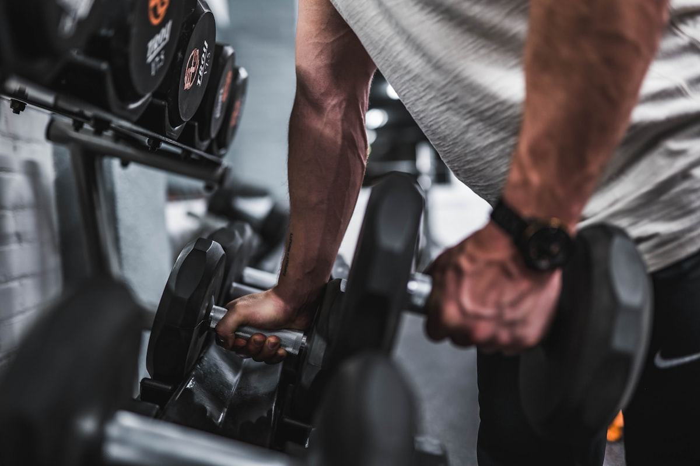
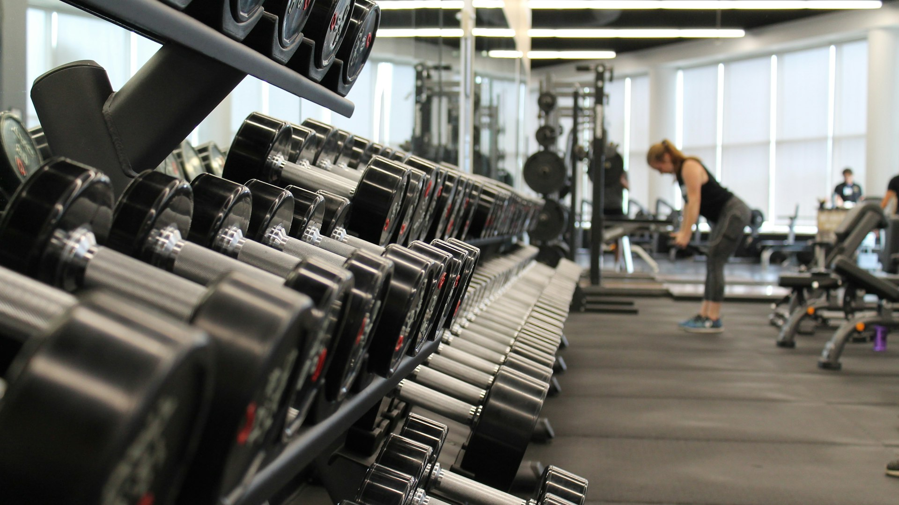

# 🖼️ 设施图片升级完成总结

## ✅ 完成的工作

### 1. **图片结构优化**
- 更新了 `components/facilities.html` 中的图片引用
- 使用更语义化的文件名
- 添加了图片加载失败的备用方案

### 2. **创建的新模块**
- `js/modules/image-manager.js` - 图片管理模块
- 集成到主应用管理器中

### 3. **图片获取指南**
- `IMAGE_SOURCES_GUIDE.md` - 详细的图片资源指南
- `QUICK_IMAGE_SETUP.md` - 快速设置指南
- `download-images.sh` - 图片下载脚本

## 📁 更新的图片结构

### 设施展示区域 (facilities-grid)
```
原来的图片 → 新的图片文件名
hero-2.jpg → strength-training.jpg (力量训练区)
hero-1.jpg → cardio-area.jpg (有氧训练区)
hero-3.jpg → yoga-studio.jpg (瑜伽教室)
training-1.jpg → personal-training.jpg (私教区)
facility-1.jpg → lounge-area.jpg (休息区)
facility-2.jpg → locker-room.jpg (更衣室)
```

### 环境展示画廊 (environment-gallery)
```
原来的图片 → 新的图片文件名
hero-1.jpg → gym-overview.jpg (健身房全景)
hero-2.jpg → equipment-zone.jpg (器械区域)
hero-3.jpg → group-class.jpg (团体课程)
facility-1.jpg → reception-area.jpg (接待区)
```

## 🔧 新增功能

### 图片管理模块特性：
- ✅ **懒加载** - 提高页面加载速度
- ✅ **错误处理** - 自动使用备用图片
- ✅ **灯箱效果** - 点击图片查看大图
- ✅ **悬停效果** - 鼠标悬停显示详情
- ✅ **响应式支持** - 移动端优化
- ✅ **图片预加载** - 缓存机制
- ✅ **占位符** - 加载失败时的友好提示

### 备用图片机制：
```html

```

## 📋 需要的图片文件

您需要下载以下10张图片并放入 `images/` 文件夹：

### 必需图片列表：
1. **strength-training.jpg** - 力量训练区域
2. **cardio-area.jpg** - 有氧训练区域
3. **yoga-studio.jpg** - 瑜伽教室
4. **personal-training.jpg** - 私人训练区
5. **lounge-area.jpg** - 休息区
6. **locker-room.jpg** - 更衣室
7. **gym-overview.jpg** - 健身房全景
8. **equipment-zone.jpg** - 器械区域
9. **group-class.jpg** - 团体课程
10. **reception-area.jpg** - 接待区

## 🎯 图片获取步骤

### 推荐网站：
1. **Unsplash.com** (首选) - 高质量免费图片
2. **Pexels.com** - 免费健身图片
3. **Pixabay.com** - 免费商用图片

### 搜索关键词：
```
gym interior, fitness center, weight training
cardio machines, yoga studio, personal trainer
gym lounge, locker room, gym equipment
group fitness class, gym reception
```

### 图片规格：
- **格式**: JPG 或 WebP
- **尺寸**: 最小 1200x800 像素
- **文件大小**: 200KB - 2MB
- **比例**: 3:2 或 16:9

## 🚀 使用方法

### 1. 下载图片
```bash
# 使用提供的脚本（需要先更新URL）
./download-images.sh

# 或手动下载并重命名
```

### 2. 检查效果
```bash
# 查看图片文件
ls -la images/

# 在浏览器中测试
open index.html
```

### 3. 验证功能
- 检查图片是否正常显示
- 测试悬停效果
- 验证点击灯箱功能
- 测试移动端响应式

## 🔍 故障排除

### 图片不显示？
1. 检查文件名是否正确
2. 确保图片在 `images/` 文件夹中
3. 验证图片格式和大小
4. 查看浏览器控制台错误信息

### 备用方案：
如果某些图片找不到，系统会自动使用现有的 `pexels-photo-*.webp` 图片作为备用。

## 📱 移动端优化

### 响应式图片：
```html

```

### 建议：
- 为移动端创建压缩版本
- 使用 WebP 格式提高性能
- 添加适当的 CSS 媒体查询

## 🎨 自定义样式

### 灯箱样式：
可以通过CSS自定义灯箱的外观：
```css
.image-lightbox {
    /* 自定义灯箱样式 */
}
```

### 悬停效果：
```css
.facility-item:hover .facility-overlay {
    opacity: 1;
    transform: translateY(0);
}
```

## 📊 性能优化

### 已实现：
- ✅ 图片懒加载
- ✅ 错误处理机制
- ✅ 图片缓存
- ✅ 渐进式加载

### 建议进一步优化：
- 使用 WebP 格式
- 实现图片压缩
- 添加 Service Worker 缓存
- 使用 CDN 加速

## 🎉 升级效果

### 用户体验提升：
- 🚀 更快的页面加载速度
- 🖼️ 更专业的图片展示
- 📱 更好的移动端体验
- 🔍 交互式图片浏览
- 💪 更强的错误容错能力

### 开发体验提升：
- 🔧 模块化的图片管理
- 📋 清晰的文件命名规范
- 🛠️ 完善的错误处理
- 📚 详细的文档指南

## ✅ 完成检查清单

- [x] 更新了设施展示组件
- [x] 创建了图片管理模块
- [x] 集成到主应用中
- [x] 添加了错误处理机制
- [x] 创建了图片获取指南
- [x] 提供了下载脚本
- [x] 添加了灯箱功能
- [x] 实现了懒加载
- [x] 支持响应式设计
- [x] 编写了完整文档

## 🔄 下一步

1. **下载图片** - 根据指南获取所需图片
2. **测试功能** - 验证所有新功能正常工作
3. **优化性能** - 根据需要进一步优化
4. **自定义样式** - 调整视觉效果以匹配品牌

您的健身网站现在拥有了专业级的图片管理系统！🎉